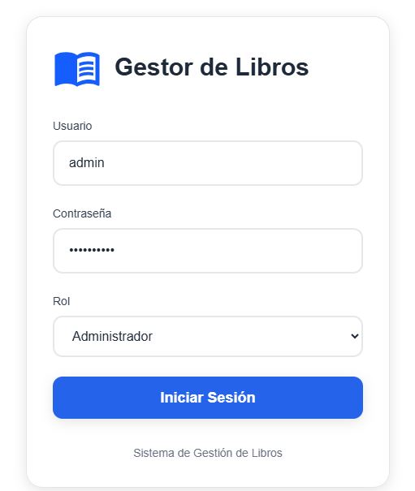
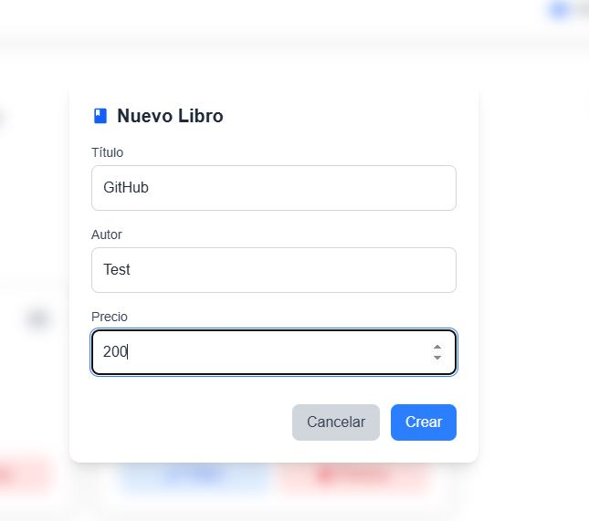
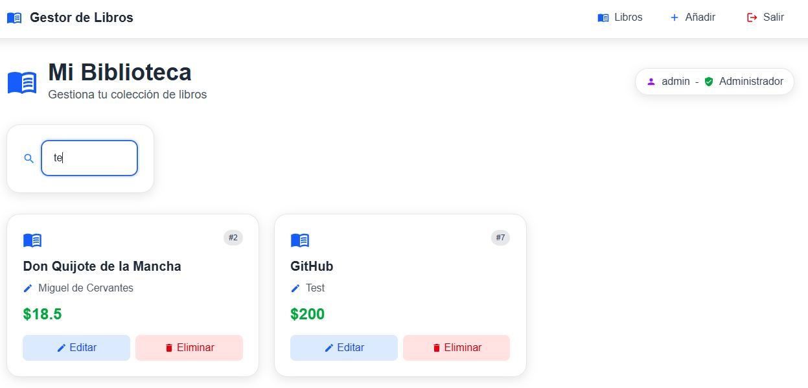

# Aplicación web para gestión de libros

App para gestionar una biblioteca sencilla con autenticación por roles.

## Capturas

<p align="center">
  
</p>

<p align="center">
  
</p>

<p align="center">
  
</p>

## Tecnologías

**Backend:**
- Python + Flask + SQLAlchemy (ORM)
- SQLite (Base de datos)
- Sistema de autenticación por roles

**Frontend:**
- React 19 + Vite + Tailwind CSS
- Framer Motion (Animaciones)
- React Router (Navegación)

## Características

- **Autenticación por roles** (Usuario, Moderador, Admin)
- **CRUD** de libros
- **Búsqueda** por título y autor
- **Diseño responsive**
- **Validaciones y manejo de errores** en el frontend y backend

## Roles y Permisos

| Rol | Ver Libros | Añadir | Editar | Eliminar |
|-----|------------|--------|--------|----------|
| **Usuario** | ✅ | ❌ | ❌ | ❌ |
| **Moderador** | ✅ | ✅ | ✅ | ❌ |
| **Admin** | ✅ | ✅ | ✅ | ✅ |

## Usuarios de Prueba

```bash
# Administrador (Acceso completo)
Usuario: admin
Contraseña: admin@123!
Rol: Admin

# Moderador (Puede añadir y editar)
Usuario: maria
Contraseña: mod_123456
Rol: Moderador

# Usuario (Solo lectura)
Usuario: juan
Contraseña: 123456
Rol: Usuario
```

## Instalación y Uso

### Backend
```bash
# Clonar repositorio
git clone https://github.com/Jesvarg/gestion-libros-flask.git

# Crear entorno virtual e instalar dependencias
cd backend
python -m venv venv
source venv/Scripts/activate
pip install -r requirements.txt

# Ejecutar el servidor
python app.py
```

### Frontend
```bash
cd frontend

# Instalar dependencias
npm install
npm run dev
```

## Estructura

```
gestion-libros/
├── backend/
│   ├── models/          # Modelos de datos
│   ├── routes/          # Rutas de la API
│   └── app.py          # Servidor principal
└── frontend/
    ├── src/
    │   ├── components/  # Componentes React
    │   ├── services/    # API calls
    │   └── styles.css   # Estilos globales
    └── package.json
```

## Notas
- Este proyecto es una demostración de habilidades para desarrollar una aplicación simple de gestión de libros.
